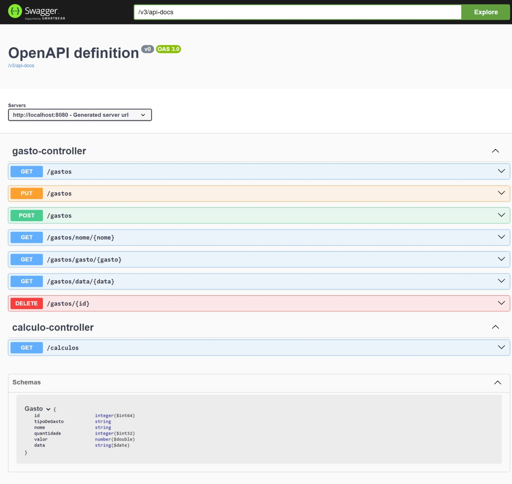

# API de Gerenciamento de gastos

## API REST de gerenciamento de gastos
Com ela você pode cadastrar, alterar, consultar e deletar seus gastos. É possível fazer consultas por nome, tipo de gasto e data, fora todos os gastos cadastrados, além de fazer a soma do gasto mensal.
O projeto ainda não está completo, serão feitas novas implementações, assim como os testes. 

### Índice
* [Preview](#Preview)
* [Tecnologias](#Tecnologias)
* [Como usar](#Como-usar)

## Preview

## Tecnologias

- Spring Boot 3
- Maven
- Spring Web
- Spring JPA
- H2 Database
- MYSQL
- Springdoc
- Git e GitHub

## Como usar

### Requisitos
- JDK 17 ou +
- Maven
- HTTPie ou outra ferramenta que faça requisições HTTP

### Executando o Projeto

Não é preciso configurar o banco de dados para testar a API, ela irá rodar com o banco em memória H2, mas suas alterações serão perdidas quando o programa for encerrado.

#### Linha de comando
- Na pasta do projeto, execute-o com o comando: mvn spring-boot:run
- para encerrar o programa, aperte o comando Ctrl + c

#### IDE
- Simplesmente execute o projeto na sua IDE favorita

A aplicação estará disponível na porta 8080

Para acessar a documentação swagger basta acessar http://localhost:8080/swagger-ui.html